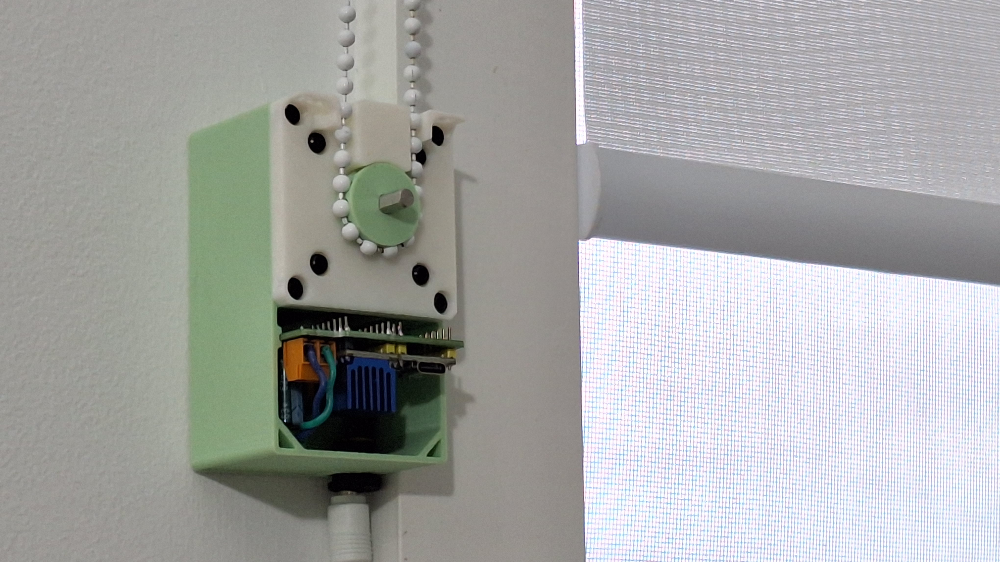
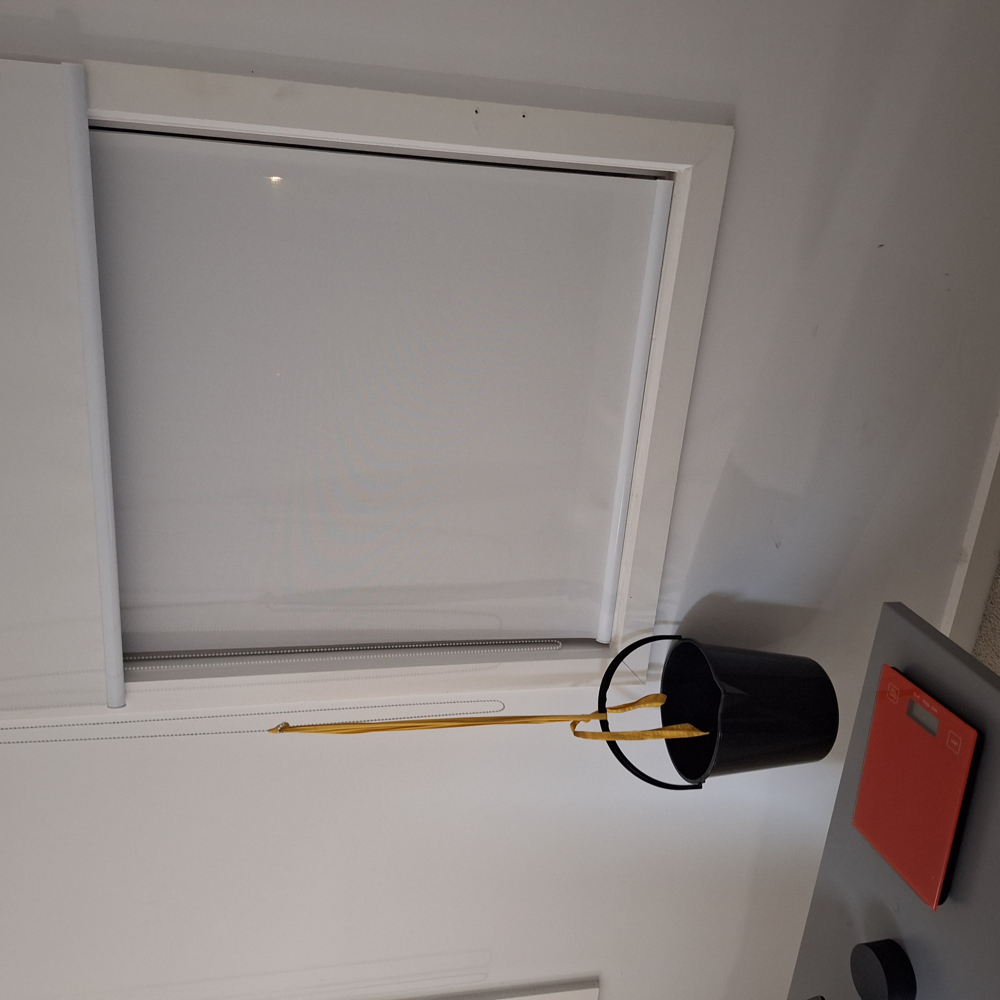
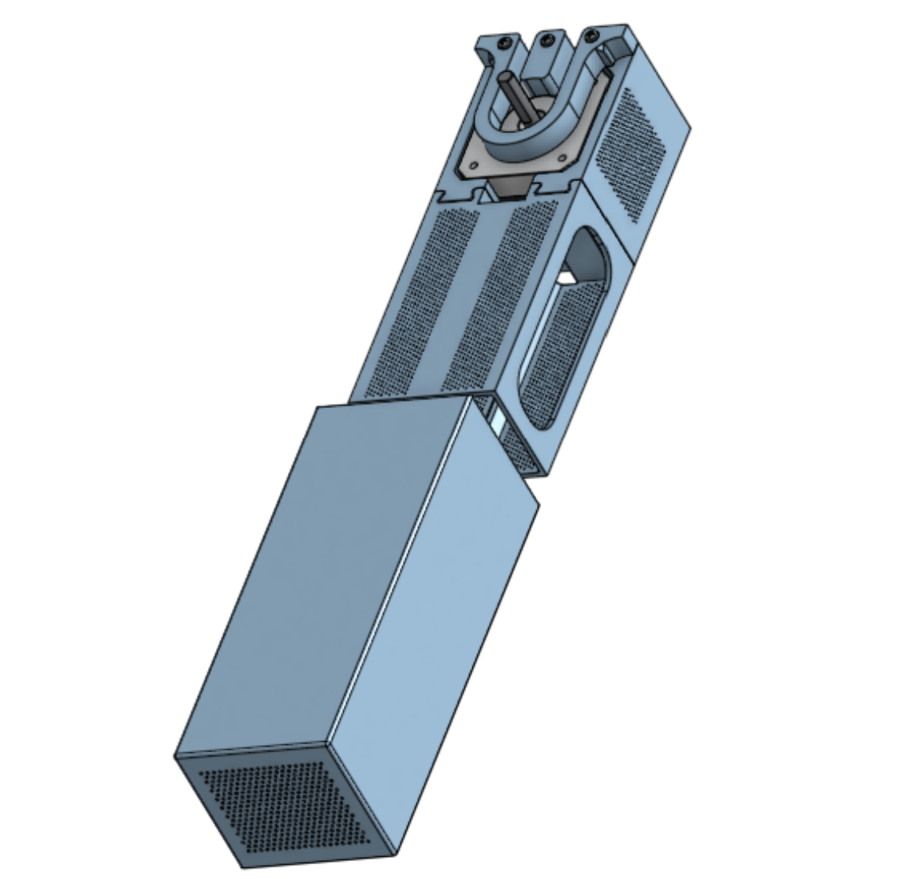
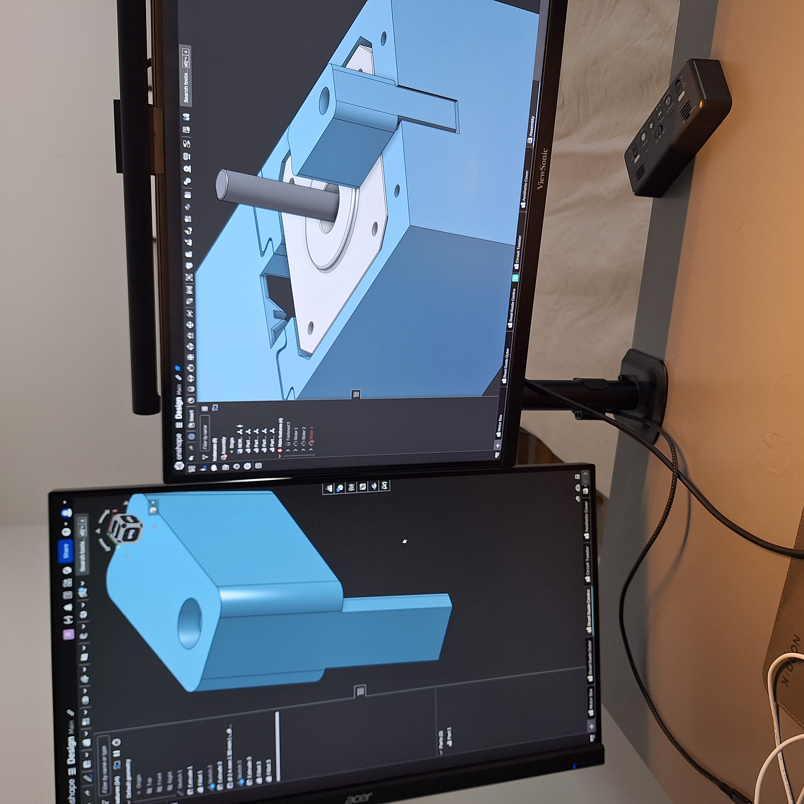
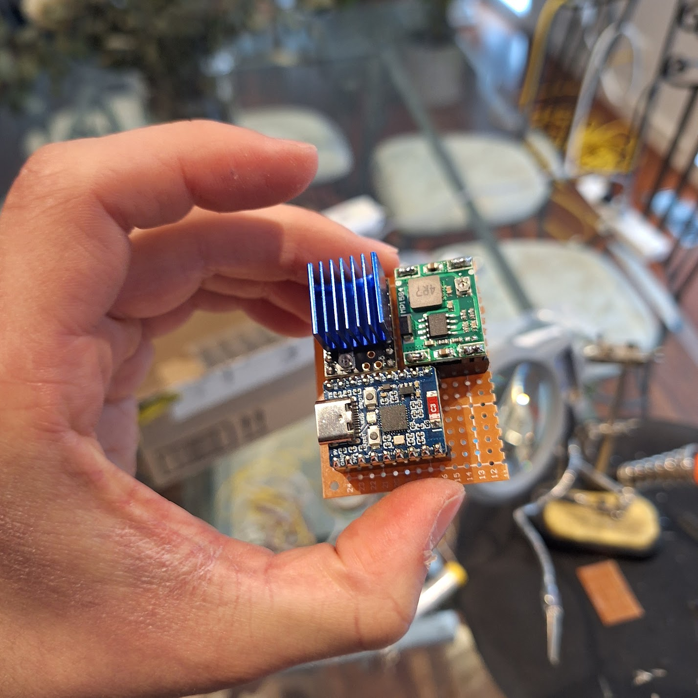
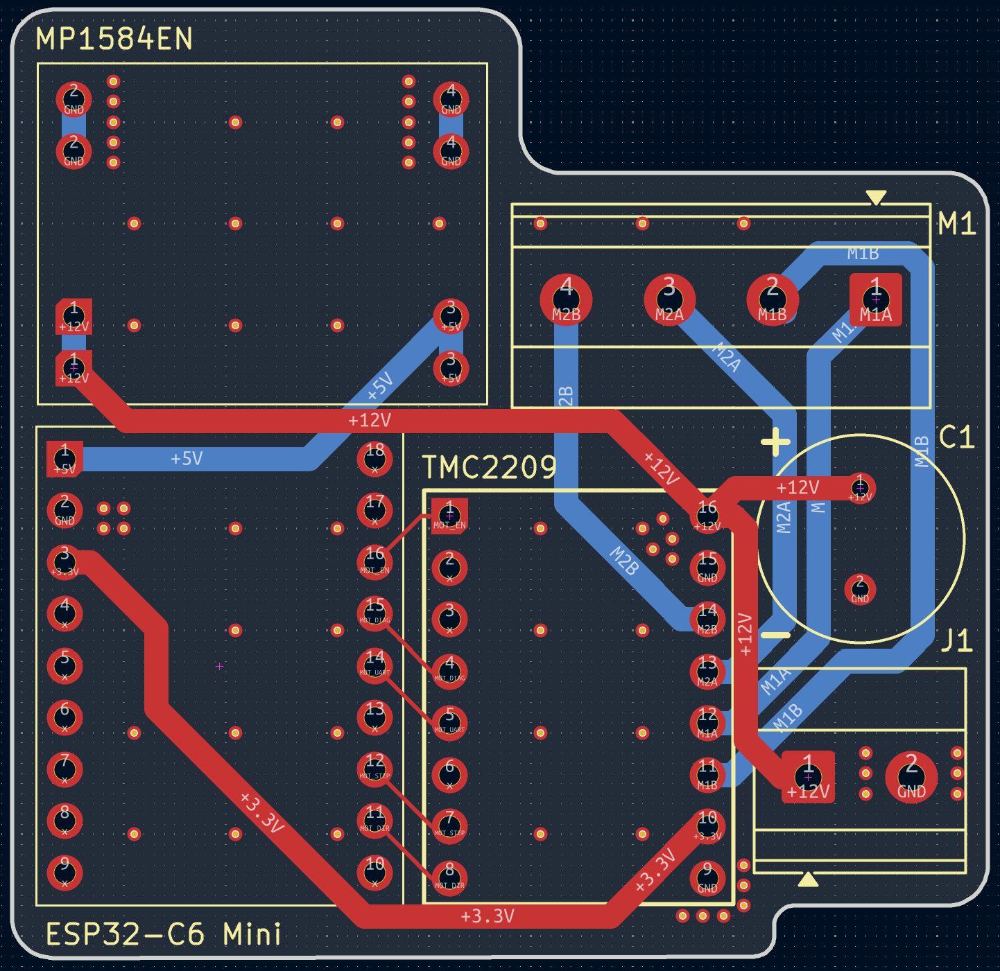
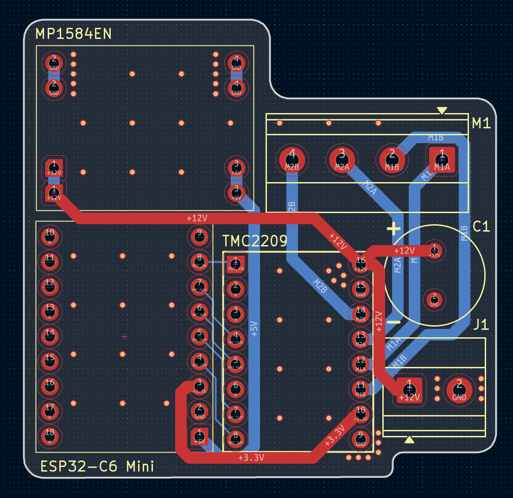
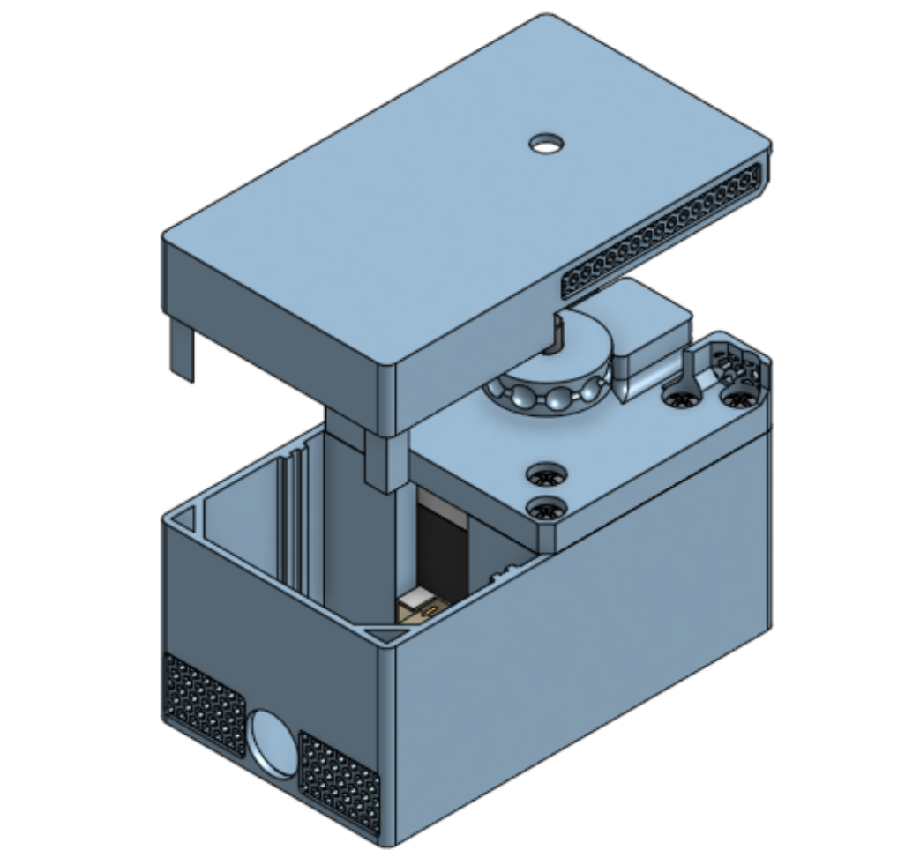

<div align="center">

# stepper-blinds-driver

**An ultra-quiet NEMA 17 retrofit driver for beaded-chain roller blinds.**

Xavier Phillips



_The stepper blinds driver with the top lid removed, showing the main sprocket and the custom PCB._

</div>

---

## Contents
- [Overview](#overview)
- [Project Snapshot](#project-snapshot)
- [Technical Skills](#technical-skills)
- [Key Design Decisions](#key-design-decisions)
- [Hardware](#hardware)
- [Control Software](#control-software)
- [Build Log](#build-log)
- [Testing](#testing)
- [What's Next](#whats-next)
- [Reflection](#reflection)
- [Documentation](#documentation)

---

## Overview

### Problem
Opening blinds automatically has a range of benefits:
- Easier to wake up in mornings, and aligns circadian rhythm
- Provides more sunlight during day (for an office, this helps improve mood, among other health benefits)

Commercial options have some limitations:
- Can be very expensive
- Almost all commercial devices use geared DC motors, and are very loud when in operation (>50dB)

### Goal
1. Low-cost (<$100)
2. Compatible with beaded-chain blinds
3. Near-silent (<40dB)

### Features
1. Actuate beaded-chain with positional control (e.g. set to 50%)
   2. High precision is not crucial, aside from the start and end positions. However, end position is a mechanical limit (blinds cannot go further than highest position).
3. Controlled via Google Home or Home Assistant for scheduled automations.
4. Device should be compact
5. Powered externally with power supply (extremely clean, minimal, easy to hide cable)
6. Buttons should be minimised for aesthetic
   7. Possible structure
      1. Ver. 1 - up/down pushbuttons, power toggle. accessible port for microcontroller. no PCB (wires)
      2. Ver. 2 - power toggle only - small, hidden same-colour micro latch switch. hidden port for microcontroller (possibly a friction fit soft tpu plastic cover for it or similar, like a port cover, same colour). PCB.
8. Easily replaceable components (motor, PCB, microcontroller). highest priority for replicability is the cog/sprocket for the beaded chain which MUST be hot swappable in seconds
9. Custom PCB for final product
10. Clean, minimal box design with all internals hidden, mountable to a wall with standard screws

---

## Project Snapshot

### Details

| **Type**               | Personal project (no course/folio behind it)                     |
| ---------------------- | ---------------------------------------------------------------- |
| **Duration**           | Started ~30 June 2026, ongoing                                   |
| **Budget**             | $90.42 true project cost (target: <$100)                         |
| **Mechanism**          | Beaded-chain actuation, positional control (e.g. set to 50%)     |
| **MCU / Control**      | ESP32-C6 Mini Dev Board (Serial CLI Firmware v1.0)               |
| **Motor / driver**     | NEMA 17 Stepper Motor (34mm, 1.5A) + TMC2209 V2.0 Stepper Driver |
| **PCB**                | Custom 2-layer PCB for all electrical components                 |
| **Mechanical CAD**     | Onshape                                                          |
| **Manufacturing**      | 3D printing                                                      |

### Specifications

| Spec                     | Value                                                                   |
| ------------------------ | ----------------------------------------------------------------------- |
| Required pulling force   | 1.8kg (bucket-tested - see build log)                                   |
| Noise target             | <40dB (commercial cheap models are >50dB)                               |
| Travel range             | Unlimited                                                               |
| Holding torque           | N/A, designed for counterbalanced or friction-balanced household blinds |
| Power supply             | 12V 3A 36W power supply                                                 |
| Ecosystem tested against | Google Home or Home Assistant (per scope - not yet tested)              |

---

## Technical Skills

| Area                   | Skills and tools                                                                                                                                                 |
| ---------------------- | ---------------------------------------------------------------------------------------------------------------------------------------------------------------- |
| Mechanical design      | Onshape CAD - hot-swappable cog/sprocket mount for the beaded chain, compact enclosure                                                                           |
| PCB design             | KiCad - custom PCB for final product (goal #7); V1 currently using off-the-shelf breakouts (TMC2209 driver module, MP1584EN buck converter) on a prototype board |
| Embedded programming   | C++ / Arduino on ESP32 (Non-blocking stepper driver integration)                                                                                                 |
| Smart home integration | Google Home or Home Assistant, for scheduled automations                                                                                                         |
| Manufacturing          | 3D printing                                                                                                                                                      |

---

## Key Design Decisions

| Decision                     | Options considered                                                                                                                                                                                | Reasoning                                                                                                  |
| ---------------------------- | ------------------------------------------------------------------------------------------------------------------------------------------------------------------------------------------------- | ---------------------------------------------------------------------------------------------------------- |
| Motor + driver               | Ranked 10 motor setups against the <40dB noise / <$100 cost constraints (full comparison below); shortlisted NEMA 17 + TMC2209, JGY-370 Worm Gear Motor, NEMA 17 (5:1 Planetary Geared) + TMC2209 | This motor is extremely well documented and has a low noise level when paired with the TMC2209 controller. |
| PCB / prototyping approach   | Off-the-shelf breakout modules (TMC2209 driver, MP1584EN buck converter) on a prototype board vs. a from-scratch custom PCB                                                                       | V1 is on protoboard for now; custom PCB for final product is goal #7                                       |
| Button / enclosure interface | Minimal-none. The device is intended to be controlled wirelessly in the final iteration. Prototypes are controlled via serial CLI.                                                                 | Buttons should be minimised for aesthetic (goal #5)                                                        |

<details>
<summary><strong>Full motor comparison</strong> (from motor research notes)</summary>

> The biggest constraints for the motor are the <40dB requirement and the cost (total cost <$100)

**What impacts motor noise?**
- DC Brushed Motors - Brush scratching
- Geared Motors - Vibrations and friction
- Magnetic hum & coil whine

Overall, the magnitude of these sounds is also proportional to the RPM of the motor, so a slower RPM motor is ideal (and has the additional advantage of making the change in light level more gradual)

| Rank | Motor Setup | Category | Torque (Nm) | Max RPM | RPM Notes | Self-Locking | Approx. Noise Level (dB) | Dimensions (mm) | Volume (cm³) |
|---|---|---|---|---|---|---|---|---|---|
| 1 | NEMA 17 (Standard 42mm) + TMC2209 | Stepper | 0.40 | 400 | Variable | No | 38 | 42.3 x 42.3 x 40.0 | 71.57 |
| 2 | JGY-370 Worm Gear Motor (12V) | Brushed DC | 1.00 | 40 | Gearbox Fixed | Yes | 42 | 76.8 x 32.0 x 25.2 | 61.93 |
| 3 | NEMA 17 (5:1 Planetary Geared) + TMC2209 | Stepper | 1.50 | 80 | Variable | No | 43 | 42.3 x 42.3 x 61.3 | 109.68 |
| 4 | 35BYJ46 Geared Stepper (12V) | Stepper | 0.30 | 30 | Variable | No | 38 | 35.0 x 35.0 x 17.2 | 21.07 |
| 5 | BGM4108 Gimbal Motor + SimpleFOC | BLDC | 0.20 | 400 | Variable | No | 32 | 46.0 x 46.0 x 24.0 | 50.78 |
| 6 | 12V 28BYJ-48 (Modified to Bipolar) | Stepper | 0.10 | 15 | Variable | No | 35 | 28.0 x 28.0 x 19.0 | 14.90 |
| 7 | 25GA-370 Gear Motor (12V) | Brushed DC | 0.50 | 60 | Gearbox Fixed | No | 45 | 25.0 x 25.0 x 52.0 | 32.50 |
| 8 | NEMA 14 + TMC2209 Driver | Stepper | 0.15 | 400 | Variable | No | 38 | 35.0 x 35.0 x 26.0 | 31.85 |
| 9 | N20 Micro Gearmotor (12V, 60 RPM) | Brushed DC | 0.25 | 60 | Gearbox Fixed | No | 45 | 26.0 x 12.0 x 10.0 | 3.12 |
| 10 | MG996R Continuous Rotation Servo | Servo | 0.90 | 100 | Variable | No | 50 | 40.7 x 19.7 x 42.9 | 34.40 |

**Shortlist**

*1. NEMA 17 + TMC2209* - This motor is extremely well documented and has a low noise level when paired with the TMC2209 controller.

*2. JGY-370 Worm Gear Motor* - This is a slightly louder, more powerful alternative to the NEMA, the second best option if the NEMA turns out to be underpowered in torque (0.40 Nm vs 1.00 Nm). Has an additional benefit of being self-locking. Slightly above the noise limit by 2dB which is an acceptable margin.

*3. NEMA 17 (5:1 Planetary Geared) + TMC2209* - Same motor as Option 1, but geared to increase torque and reduce max RPM. Similar noise level and torque to Option 2, but ranked lower due to increased complexity.

</details>

---

## Hardware

### Mechanical (Onshape)
The main mechanical component is the mount, featuring two compartments. A thick-walled compartment which is load-bearing and contains the NEMA17, in addition to a thin-walled circuit compartment. 

To connect the NEMA17 to the mount, there is a face plate, which also features guides for the beaded-chain to be routed through.

There's also a cosmetic lid which is friction-fit using two pins for alignment and security, hiding the internal circuit while being easy to remove.

The sprocket is parametrically designed based on the following formulas.

The box features hexagonal ventilation holes which balance structural integrity and FDM manufacturability with sufficient surface area for thermal convection to prevent overheating.

### Electronics (KiCad)
The electronics involved in this project are for controlling and powering the motor. The ESP32 is the brain, allowing programmed movement logic and eventually communication with Google Home and other smart home systems via Matter over WiFi. The TMC2209 acts as an interface between the ESP32 and the NEMA17, and via the StealthChop2 feature, it allows ultra-quiet motor movement. The MP1584EN is a simple buck converter to step down the 12V from the power supply to the 5V required for the ESP32. 

I decided to use a custom PCB because I wanted to make multiple of the device, and eventually open-source it, so I decided inserting components into a PCB would be much easier than wiring spaghetti and frustrating breadboarding. It also gave me a chance to upskill KiCAD and learn about circuit schematics, rule checkers, and the PCB development and manufacturing process.

**BOM**

| Component | Source | Pack Size (Bought) | Qty Required | Pack Cost (AUD) | True Project Cost (AUD) |
|---|:---:|:---:|:---:|:---:|:---:|
| ESP32-C6 Mini Dev Board | Amazon AU | 1 | 1 | $25.01 | $25.01 |
| 12V 3A 36W Power Supply | Amazon AU | 1 | 1 | $21.99 | $21.99 |
| NEMA 17 Stepper Motor (34mm, 1.5A) | Amazon AU | 1 | 1 | $20.99 | $20.99 |
| TMC2209 V2.0 Stepper Driver | Amazon AU | 5 | 1 | $37.03 | $7.41 |
| MP1584EN 3A DC-DC Buck Converter | Amazon AU | 15 | 1 | $18.87 | $1.26 |
| Custom 2-Layer PCB | JLCPCB | 5 | 1 | $2.00 | $0.40 |
| M3 Button Head Screw Kit | Amazon AU | 300 | 8 | $10.99 | $0.29 |
| M3 Nylon Standoffs & Nuts Kit | Amazon AU | 320 | 4 | $12.99 | $0.16 |
| 3M VHB Double Sided Tape | Amazon AU | 33m | 10 cm | $12.99 | $0.04 |
| 2.1mmx5.5mm DC Power Jack (Panel Mount) | Amazon AU | 30 | 1 | $16.89 | $0.56 |
| 100µF 50V Electrolytic Capacitor (Polarized) | Jaycar Electronics | 1 | 1 | $1.00 | $1.00 |
| 60/40 Rosin Core Solder 0.71mm | Workshop | 15g | Variable | $0.00 | $0.00 |
| 24 AWG Solid Core Hookup Wire | Workshop | N/A | Variable | $0.00 | $0.00 |
| **Totals** | | | | **$180.75** | **$79.11** |

---

## Control Software
I wanted to keep this deliberately simple and write it fully myself so I could understand how the stepper control loop works, rather than relying on agentic tools to write something complex that I wouldn't fully understand under the hood.

**What it does:**
- Serial-based control to move to a pre-defined top and bottom position for the blinds
- Pause command to cancel movement with smooth acceleration.

**What it deliberately doesn't do (and why):**
- Other features (e.g. Matter over WiFi, auto calibration) have been left out due to time constraints for now and will be developed further in the future.

**Walkthrough**

* **`read_int()`:** Serial user input parser that checks for user commands and accepts valid inputs as commands (`0: Stop`, `1: Top`, `2: Bottom`).
* **`FastAccelStepper` Engine:** Asynchronously drives the STEP/DIR signal generation using ESP32 hardware timers, allowing smooth acceleration and deceleration ramps in the background.

---

# Build Log

### 2026-06-30 - Measuring required pull force



- Used a water bucket attached to the blinds to measure the force required to move them.
- At 1.7 kg, the blinds remained stationary. At 1.8 kg, the blinds were able to move.
- The 20 mm NEMA17 was determined to have insufficient torque, leading to the decision to use the 34 mm NEMA17 instead.

### 2026-07-02 - Initial CAD design





 - This design has a removable circuit box area, using dovetail cutouts. It also has removable guides for the beaded chains, secured by M2 screws.

### 2026-07-05 - Perfboard Assembly



 - Image of the components laid out on a perfboard. I've cut the perfboard down to a smaller size for compactness in this image, but for later perfboard iterations I used the full size, just for ease of wiring and troubleshooting (since it was only a prototype, the compactness was evaluated as somewhat irrelevant)

### 2026-07-07 - PCB Design 1



### 2026-07-10 - PCB Design 2



- Modified the PCB schematic in KiCAD to flip the footprint of the ESP32C6 by 180 degrees. This ensures that it can be wired correctly while having the USB port point towards the edge of the board, instead of the centre. Code was also updated to reflect the new pins.

### 2026-07-21 - Control Software Draft

```cpp
#include <Arduino.h>
#include <FastAccelStepper.h>

constexpr int PIN_EN = 14;
constexpr int PIN_SPREAD = 15;
constexpr int PIN_UART = 18;
constexpr int PIN_STEP = 20;
constexpr int PIN_DIR = 21;

constexpr int SPEED = 500;  // step per sec
constexpr int ACCEL = 1000; // step per sec^2

constexpr int TOP_POSITION = 0;       // steps
constexpr int BOTTOM_POSITION = 1000; // steps

enum user_input
{
  PAUSE,
  TOP,
  BOTTOM,
  OPTIONS_COUNT
};

user_input command = PAUSE;

int read_int()
{
  int command = -1;

  if (Serial.available() > 0)
  {
    command = Serial.parseInt();

    Serial.printf("Command received: %d\n", command);
  }

  return command;
};

FastAccelStepperEngine engine = FastAccelStepperEngine();
FastAccelStepper *stepper = nullptr;

void setup()
{
  pinMode(PIN_STEP, OUTPUT);
  digitalWrite(PIN_SPREAD, LOW);

  Serial.begin(115200);
  delay(1000);

  engine.init();

  stepper = engine.stepperConnectToPin(PIN_STEP);

  if (stepper)
  {
    Serial.println("SUCCESS: Stepper connected!");

    stepper->setDirectionPin(PIN_DIR);
    stepper->setEnablePin(PIN_EN);
    stepper->setAutoEnable(true);
    stepper->setSpeedInHz(SPEED);
    stepper->setAcceleration(ACCEL);
    stepper->setCurrentPosition(0);
  }
  else
  {
    Serial.println("ERROR: Stepper failed to connect.");
  }
}

void loop()
{

  command = static_cast<user_input>(read_int());

  if (command != -1)
  {
    Serial.printf("Current Position: %d Enter an option:\n\t0.Pause\n\t1. Move Top\n\t2. Move Bottom\n", stepper->getCurrentPosition());

    switch (command)
    {
    case PAUSE:
      Serial.println("Action: STOP");
      stepper->stopMove();
      break;

    case TOP:
      Serial.println("Action: TOP");
      stepper->moveTo(TOP_POSITION, false);
      break;

    case BOTTOM:
      Serial.println("Action: BOTTOM");
      stepper->moveTo(BOTTOM_POSITION, false);
      break;

    default:
      Serial.printf("Invalid command! Enter a valid integer between 1 and %d.\n", OPTIONS_COUNT);
      break;
    }
  }
}
```
 - Just a basic serial-control script for testing basic functionality (movement up, down, and pausing)

### 2026-07-24 - CAD Design 2



 - This was a major transition. The two-box dovetail architecture was replaced with a single box with two compartments. 

### 2026-07-30 - Motor Testing

- Upon arrival of the board (**2026-07-30**) and initial basic testing of roller blind movement (a short test program), I determined that the NEMA17 tended to stall quite easily. Upon closer inspection and troubleshooting (including verifying that it did work with a much lighter, smaller roller blind), I determined that the cause was simply insufficient current. The 12V wall adapter I was using only had a rated current of 1A, much less than the planned 3A.
- Order a 12V 3A power supply ASAP, in order to provide sufficient power for the NEMA17 to lift basic blinds.

---

## Testing

| Test                                 | Result          |
| ------------------------------------ | --------------- |
| Bucket test - required pulling force | 1.8kg confirmed |
| Noise level (<40dB target)           | Not yet tested  |

---

## What's Next

- The next step is writing the implementation that includes Matter, rather than the basic hard-coded values the script currently uses. 
	- For the implementation, I want to keep it buttonless for aesthetics and simplicity of circuitry. So I'm planning to use StallGuard to determine increased resistance at the top of the range of motion (ROM) for calibration, as well as a reduced resistance at the bottom of ROM.

---

## Reflection

I learned a massive amount from this project. On the CAD side, I learned about using variables in my designs, rather than "magic numbers" for dimensions, so everything in my design is fully adjustable via the variables table. I also learned about a lot more Onshape's sketch tools (tangent, normal, and perpendicular constraints), as well as their 3D tools (Featurescripts like Grid Extrude for ventilation, alongside operations like revolve which I used for the sprocket). 

I also learned KiCAD from scratch during this project, which was a great learning experience and upskilling opportunity into a new field. Historically I used graphical software like Canva or Illustrator for circuit diagrams, but learning how to write proper, verified schematics was really enjoyable, and seeing my own custom-designed PCB arrive was extremely rewarding. Contrary to what I used to assume about PCBs, it actually _saved_ me time, as I used to have to spend weeks fiddling with breadboards because I didn't take the time to plan my circuit thoroughly. That, combined with the time saved from soldering (only took ~10min to solder the entire PCB!), allowed me to finalise all electronics in about a week.

---

## Documentation

- Firmware Code: [`/firmware`](firmware/)
- PCB (Schematic + Gerbers): [`/hardware/pcb`](hardware/pcb/)
- CAD Files: [`/hardware/cad`](hardware/cad/)

## Acknowledgements & License

[gin66/FastAccelStepper: A high speed stepper library for Atmega 168/328p (nano), Atmega32u4, Atmega 2560, ESP32, ESP32S2, ESP32S3, ESP32C3, ESP32C6, Atmel SAM Due, Raspberry pi pico and pico 2](https://github.com/gin66/FastAccelStepper)

This project is licensed under the MIT License. See the [LICENSE](LICENSE) file for details.

<p align="center"><sub>Personal project, July 2026.</sub></p>
